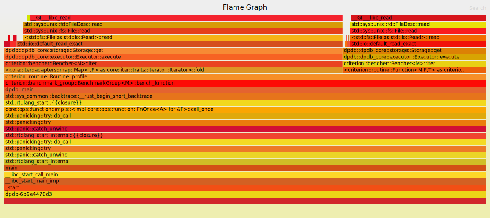
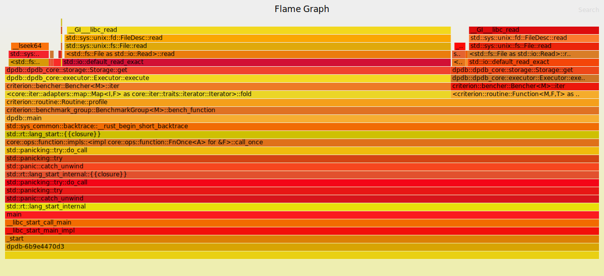
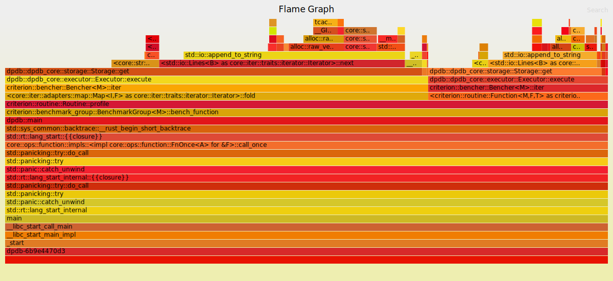

# DPDB

## Usage

For now it's a KV database with persistence, so it's more that a hashmap. To store a value, use the `set key value` syntax, to retrive, use `get key`

```shell
>> set a 2
4.957024ms
>> set b 2
3.055188ms
>> get b
=> 2
310.024µs
```

## Benchmarks

### 3. Using hash map as index

Reading is extremely fast, but writing is slowed down, maintaining an index has performance cost.

```shell
write                   time:   [3.3972 ms 3.8435 ms 4.5009 ms]
                        change: [+17.584% +64.366% +118.15%] (p = 0.00 < 0.05)
                        Performance has regressed.
Found 19 outliers among 100 measurements (19.00%)
  9 (9.00%) low mild
  3 (3.00%) high mild
  7 (7.00%) high severe

read                    time:   [2.1240 µs 2.1390 µs 2.1535 µs]
                        change: [-99.926% -99.925% -99.924%] (p = 0.00 < 0.05)
                        Performance has improved.
Found 4 outliers among 100 measurements (4.00%)
  2 (2.00%) low mild
  1 (1.00%) high mild
  1 (1.00%) high severe
```

### 2. Reduce the occurrence of filesystem reads

Each key-value pair loading requires at least calling `read_exact` twice, there is room for further improvement, for example, read a lot of bytes at once, below some threshold, but that is not the point, the point is using index to reduce the number of filesystem calls to one.

```shell
write                   time:   [1.9464 ms 1.9681 ms 1.9946 ms]
Found 8 outliers among 100 measurements (8.00%)
  3 (3.00%) high mild
  5 (5.00%) high severe

Benchmarking read: Collecting 100 samples in estimated 5.0639 s (2400 iteration)

read                    time:   [2.1284 ms 2.1339 ms 2.1396 ms]
Found 2 outliers among 100 measurements (2.00%)
  2 (2.00%) high mild
```



### 1. Using a compact scheme to store data

Reading data with compact scheme is a lot slower. The flamegraphs shows that `_GI__libc_read` occupied too much CPU time.

```shell
write                   time:   [1.9642 ms 1.9818 ms 2.0020 ms]
                        change: [-2.2815% -0.5789% +1.0794%] (p = 0.51 > 0.05)
                        No change in performance detected.
Found 10 outliers among 100 measurements (10.00%)
  3 (3.00%) high mild
  7 (7.00%) high severe

read                    time:   [7.1030 ms 7.1104 ms 7.1181 ms]
                        change: [+2299.5% +2306.2% +2312.9%] (p = 0.00 < 0.05)
                        Performance has regressed.
Found 3 outliers among 100 measurements (3.00%)
  1 (1.00%) low mild
  2 (2.00%) high mild
```



### 0. Store data line by line

```shell
write                   time:   [1.9689 ms 1.9942 ms 2.0240 ms]
Found 10 outliers among 100 measurements (10.00%)
  1 (1.00%) high mild
  9 (9.00%) high severe

read                    time:   [294.32 µs 295.02 µs 295.86 µs]
```


